# ge_demo

Simple demo of Great Expectations with data + an expectation suite

## This is our dataset (Titanic with some modifications)
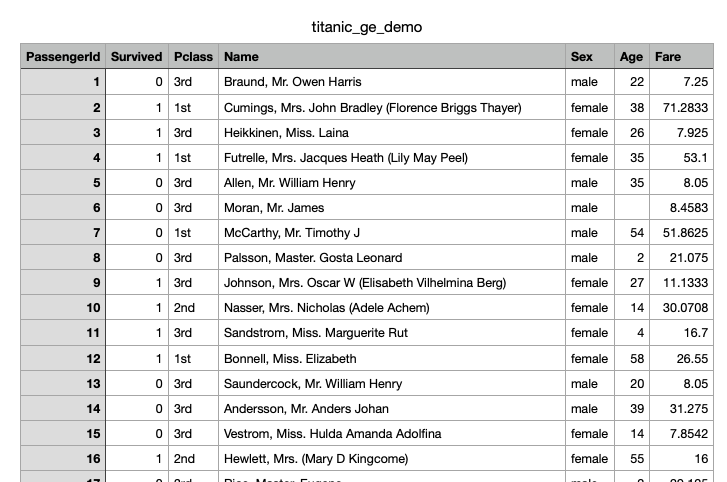

## Running `great_expectations init`
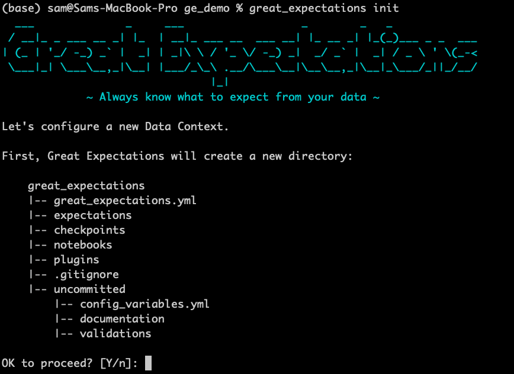

## The great_expectations directory structure
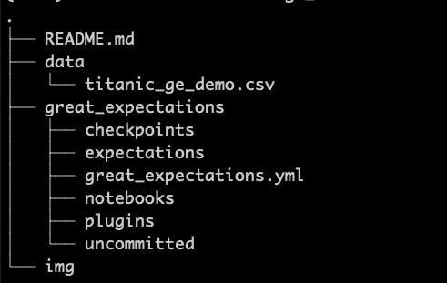

## Running `great_expectations datasource new`
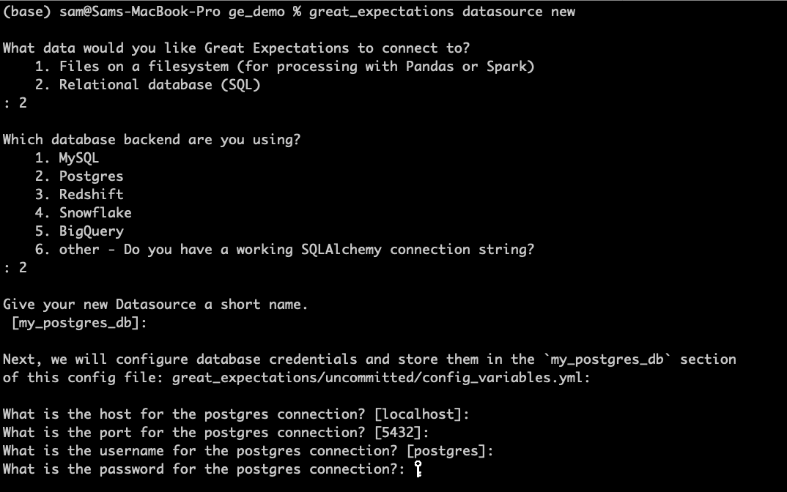

## Supported types of datasources
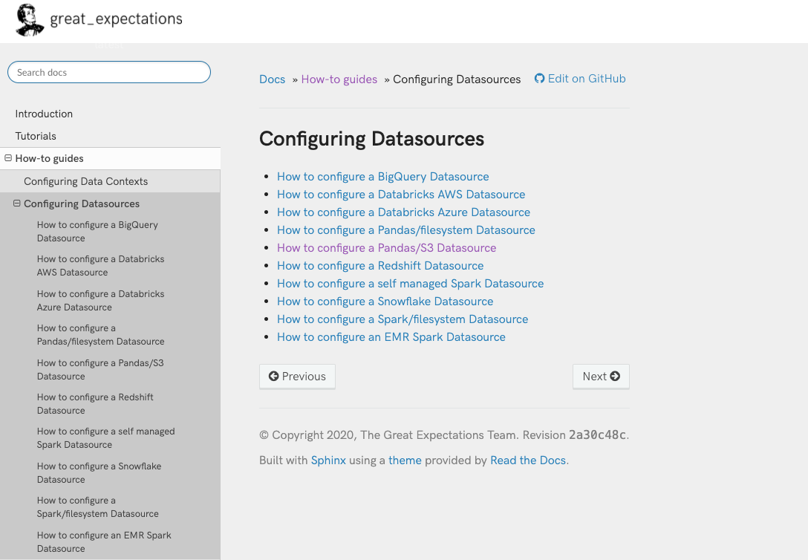

## The glossary of built-in Expectations

###Table expectations
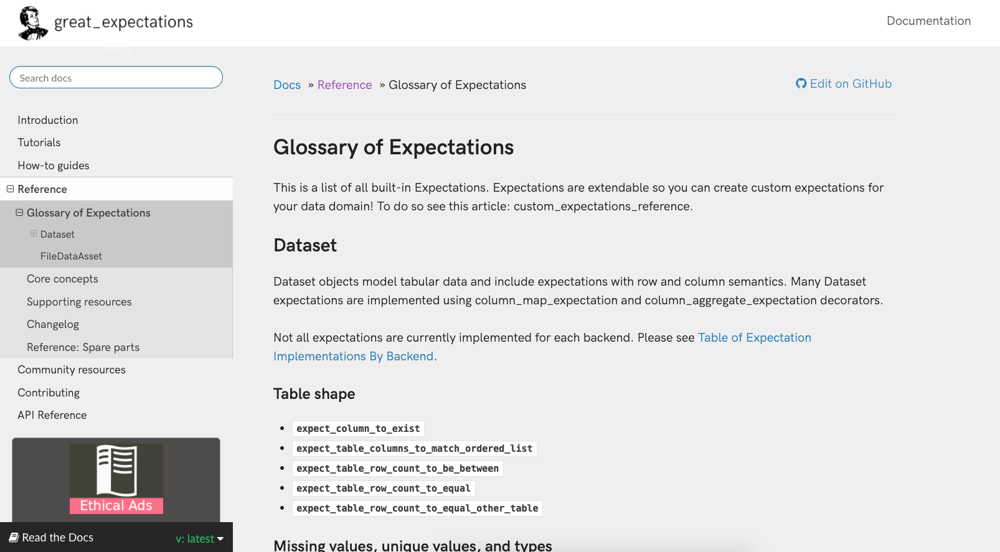

### Column expectations
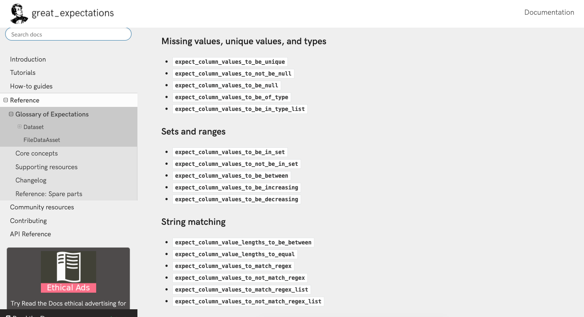

## Scaffolder and profiling

### Notebook created with `suite scaffold`
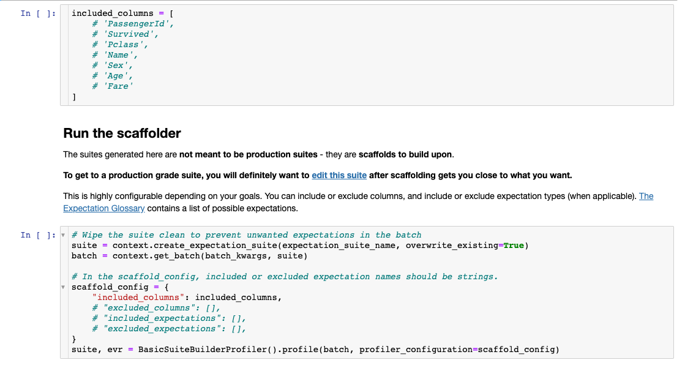

### Output of scaffolding

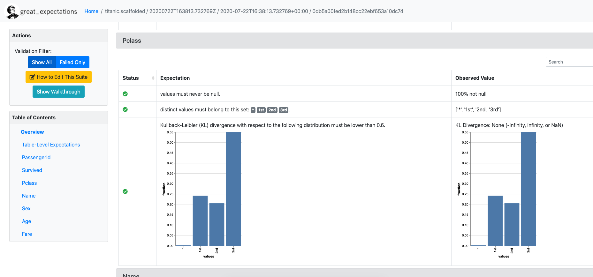

## Stores
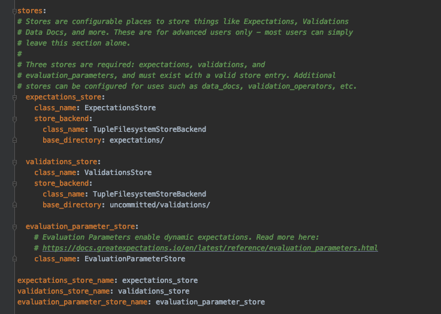

## Slack notifications

### Slack hook configuration as "validation action"
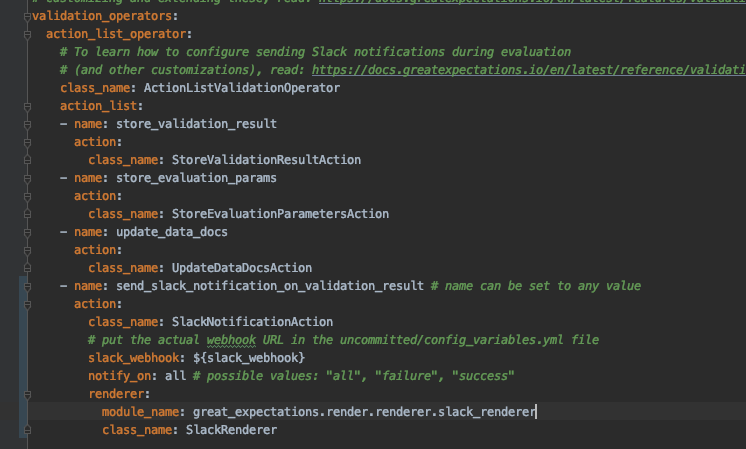

### Slack notification in action

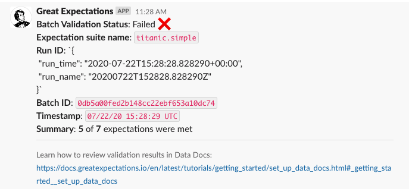
